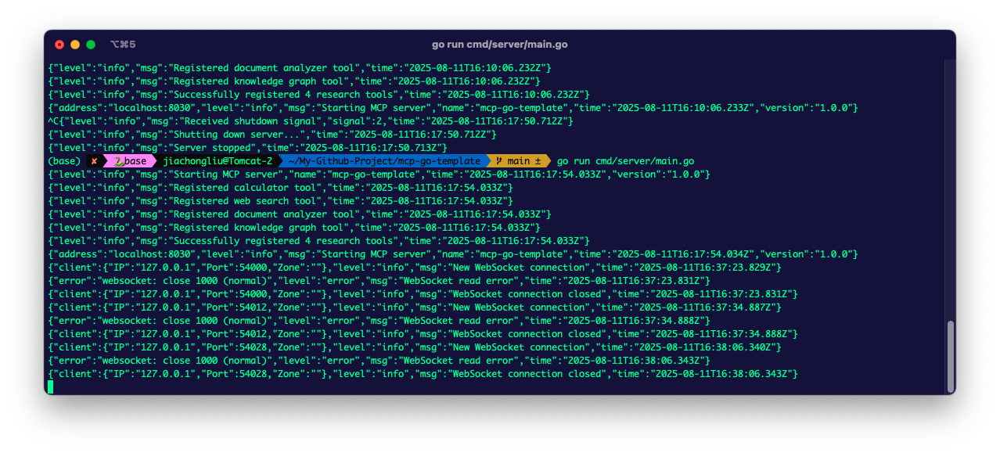
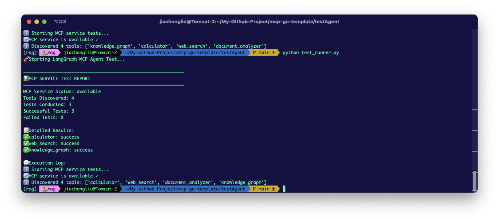

# mcp-go-template

*[English](README.md) | 中文*

# Golang MCP (Model Context Protocol) 服务模板

这是一个基于 Golang 实现的 MCP 服务模板，提供了完整的项目结构和基础功能实现。

## 关于项目






## 项目结构

```
mcp-go-template/
├── api/                        # API 定义和规范
│   ├── mcp/
│   │   ├── v1/
│   │   │   └── schema.json     # MCP 协议 JSON Schema
│   │   └── openapi.yaml        # OpenAPI 规范文档
│   └── README.md
├── cmd/                        # 应用程序入口点
│   └── server/
│       └── main.go
├── docs/                       # 项目文档
│   ├── architecture.md         # 架构设计文档
│   ├── deployment.md           # 部署指南
│   └── examples.md             # 使用示例
├── internal/                   # 私有应用代码
│   ├── config/
│   │   └── config.go          # 配置管理
│   ├── server/
│   │   └── server.go          # 主服务器逻辑
│   ├── tools/                 # MCP 工具实现
│   │   ├── registry.go        # 工具注册器
│   │   └── examples/
│   │       ├── calculator.go  # 计算器工具示例
│   │       ├── web_search.go  # Web搜索工具
│   │       ├── document_analyzer.go # 文档分析工具
│   │       └── knowledge_graph.go   # 知识图谱工具
│   ├── resources/             # MCP 资源管理
│   │   ├── registry.go        # 资源注册器
│   │   └── examples/
│   │       └── memory.go      # 内存资源示例
│   └── prompts/               # MCP 提示管理
│       ├── registry.go        # 提示注册器
│       └── examples/
│           └── templates.go   # 提示模板示例
├── pkg/                       # 公共库代码
│   ├── mcp/
│   │   ├── types.go          # MCP 协议类型定义
│   │   ├── handler.go        # MCP 处理器
│   │   └── validation.go     # 协议验证
│   └── utils/
│       └── logger.go         # 日志工具
├── test/                      # 测试代码
│   ├── integration/           # 集成测试
│   └── testdata/             # 测试数据
├── testAgent/                 # LangGraph智能体测试
│   ├── langgraph_mcp_agent.py # LangGraph MCP测试智能体
│   ├── test_runner.py         # 测试运行器
│   └── requirements.txt       # Python依赖
├── go.mod
├── go.sum
├── README.md
├── Dockerfile
└── docker-compose.yml
```

## 特性

- 🚀 完整的 MCP 协议实现
- 🔧 可扩展的工具系统
- 📦 资源管理支持
- 🎯 提示模板系统
- 🔒 安全的中间件支持
- 📝 完整的文档和示例
- 🐳 Docker 支持
- ✅ 完整的测试覆盖
- 🤖 LangGraph 智能体集成测试

## 快速开始

```bash
# 克隆项目
git clone <your-repo-url>
cd mcp-go-template

# 初始化 Go 模块
go mod init github.com/chongliujia/mcp-go-template

# 安装依赖
go mod tidy

# 运行服务
go run cmd/server/main.go

# 或使用 Docker
docker-compose up
```

## 实现状态

- ✅ 项目结构设计
- ✅ 基础 MCP 协议实现
- ✅ 服务器核心功能
- ✅ 深度研究工具系统
- ✅ 配置管理系统
- ✅ Docker 支持

## 深度研究工具集

本项目专为深度研究场景设计，提供以下高级工具：

### 🔍 Web 搜索工具 (web_search)
- 支持多搜索引擎 (DuckDuckGo, Bing, Google)
- 可配置搜索结果数量和安全搜索
- 结构化搜索结果输出

### 📄 文档分析工具 (document_analyzer)
- 支持文件、URL、文本直接分析
- 关键词提取和频率分析
- 文档统计信息（字数、句数、阅读时间等）
- 自动摘要生成
- 实体识别

### 🕸️ 知识图谱工具 (knowledge_graph)
- 从文本构建知识图谱
- 实体提取（人物、组织、地点、概念等）
- 关系推理和权重计算
- 图谱可视化和查询

### 🧮 计算器工具 (calculator)
- 基础数学运算
- 支持浮点数运算

## 开发指南

### 添加新工具

1. 在 `internal/tools/examples/` 下创建新的工具文件
2. 在 `internal/tools/registry.go` 中注册新工具
3. 实现 MCP 工具接口

### 添加新资源

1. 在 `internal/resources/examples/` 下创建新的资源文件
2. 在 `internal/resources/registry.go` 中注册新资源
3. 实现 MCP 资源接口

### 配置管理

项目使用 Viper 进行配置管理，支持多种配置格式。配置文件位于 `internal/config/config.go`。

## 测试

### Go 单元测试

```bash
# 运行单元测试
go test ./...

# 运行集成测试
go test ./test/integration/...

# 测试覆盖率
go test -cover ./...
```

### LangGraph 智能体测试

使用 LangGraph 构建的智能体来测试 MCP 服务的完整功能：

```bash
# 进入测试目录
cd testAgent

# 安装 Python 依赖（如果需要）
pip install -r requirements.txt

# 快速连接测试
python test_runner.py quick

# 完整功能测试
python test_runner.py
```

智能体测试功能：
- 🔌 WebSocket 连接和 MCP 协议握手
- 🛠️ 所有工具的自动发现和测试
- 📊 详细的测试报告生成
- 🤖 基于 LangGraph 的智能工作流

## 部署

详见 `docs/deployment.md`

## 贡献

欢迎提交 Issue 和 Pull Request！

## 许可证

MIT License