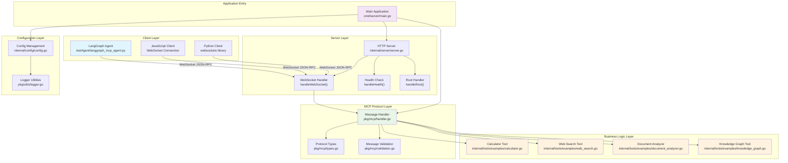

# 基于 Go 语言开发 MCP 服务：从架构到实践

## 引言

随着 AI 应用的快速发展，模型上下文协议（Model Context Protocol, MCP）作为一种标准化的通信协议，正在成为连接 AI 模型与各种工具和资源的重要桥梁。本文将深入探讨如何使用 Go 语言构建高性能、可扩展的 MCP 服务，并分享一个完整的架构设计和实现方案。

## 什么是 MCP？

MCP（Model Context Protocol）是一个开放标准，旨在为 AI 应用提供统一的工具和资源访问接口。它定义了客户端（AI 模型）与服务端（工具提供者）之间的通信规范，支持：

- 工具调用（Tools）
- 资源访问（Resources）
- 提示模板（Prompts）
- 双向通信

## 为什么选择 Go 语言？

Go 语言在构建 MCP 服务方面具有独特优势：

1. **并发性能**: Go 的 goroutine 和 channel 机制天然适合处理大量并发连接
2. **内存效率**: 编译型语言，内存占用小，启动速度快
3. **网络编程**: 标准库对 WebSocket、HTTP 提供良好支持
4. **部署便利**: 单一二进制文件，容器化部署简单
5. **生态完善**: 丰富的第三方库支持

## 系统架构设计

我们设计的 MCP Go 服务采用分层架构，确保了模块化、可扩展性和可维护性：

### 1. 系统整体架构



### 2. 核心组件

#### 应用程序入口 (`cmd/server/main.go`)

作为整个服务的启动点，负责：
- 配置加载和验证
- 日志系统初始化
- MCP 处理器创建
- 工具注册
- 服务器启动和优雅关闭

```go
// 文件: cmd/server/main.go
func main() {
    // Parse command line flags
    var (
        configPath = flag.String("config", "", "Path to configuration file")
        logLevel   = flag.String("log-level", "", "Log level (debug, info, warn, error)")
        version    = flag.Bool("version", false, "Show version information")
    )
    flag.Parse()

    // Load configuration
    cfg, err := config.Load(*configPath)
    if err != nil {
        utils.Fatalf("Failed to load configuration: %v", err)
    }

    // Create server capabilities based on configuration
    capabilities := createServerCapabilities(cfg)

    // Create server info
    serverInfo := mcp.ServerInfo{
        Name:    cfg.MCP.Name,
        Version: cfg.MCP.Version,
    }

    // Create MCP handler
    handler := mcp.NewBaseHandler(serverInfo, capabilities)

    // Register example tools if tools are enabled
    if cfg.IsToolsEnabled() {
        if err := registerTools(handler); err != nil {
            logger.WithError(err).Fatal("Failed to register tools")
        }
    }

    // Create and configure server
    srv := server.New(cfg, handler)
    srv.Start(ctx)
}
```

#### HTTP 服务器 (`internal/server/server.go`)

提供多个端点支持不同需求：

```go
// 文件: internal/server/server.go
type Server struct {
    config   *config.Config
    handler  mcp.Handler
    upgrader websocket.Upgrader
    logger   *logrus.Logger
}

func (s *Server) Start(ctx context.Context) error {
    mux := http.NewServeMux()
    mux.HandleFunc("/mcp", s.handleWebSocket)     // MCP WebSocket 连接
    mux.HandleFunc("/health", s.handleHealth)     // 健康检查
    mux.HandleFunc("/", s.handleRoot)             // 服务信息
    
    server := &http.Server{
        Addr:         s.config.GetAddress(),
        Handler:      mux,
        ReadTimeout:  time.Duration(s.config.Server.Timeout) * time.Second,
        WriteTimeout: time.Duration(s.config.Server.Timeout) * time.Second,
    }
    
    return server.ListenAndServe()
}
```

WebSocket 连接处理是核心功能：

```go
// 文件: internal/server/server.go
func (s *Server) handleConnection(conn *websocket.Conn) {
    for {
        // Read message
        messageType, data, err := conn.ReadMessage()
        if err != nil {
            if websocket.IsUnexpectedCloseError(err, websocket.CloseGoingAway, websocket.CloseAbnormalClosure) {
                s.logger.WithError(err).Error("WebSocket read error")
            }
            break
        }

        if messageType != websocket.TextMessage {
            s.logger.Warn("Received non-text message, ignoring")
            continue
        }

        // Parse MCP message
        var message mcp.Message
        if err := json.Unmarshal(data, &message); err != nil {
            s.logger.WithError(err).Error("Failed to parse MCP message")
            
            // Send error response
            errorResponse := mcp.NewErrorResponse(nil, mcp.ParseError, "Invalid JSON", err.Error())
            s.sendMessage(conn, errorResponse)
            continue
        }

        // Handle the message
        response, err := s.handler.HandleMessage(context.Background(), &message)
        if err != nil {
            s.logger.WithError(err).Error("Message handling failed")
            continue
        }

        // Send response if there is one
        if response != nil {
            s.sendMessage(conn, response)
        }
    }
}
```

#### MCP 协议处理器 (`pkg/mcp/handler.go`)

实现完整的 MCP 协议支持：

```go
// 文件: pkg/mcp/handler.go
type BaseHandler struct {
    serverInfo   ServerInfo
    capabilities ServerCapabilities
    tools        map[string]ToolHandler
    resources    map[string]ResourceHandler
    prompts      map[string]PromptHandler
    initialized  bool
}

func (h *BaseHandler) HandleMessage(ctx context.Context, message *Message) (*Message, error) {
    if message == nil {
        return NewErrorResponse(nil, InvalidRequest, "message cannot be nil", nil), nil
    }

    if message.IsRequest() {
        return h.handleRequest(ctx, message)
    }

    if message.IsNotification() {
        return h.handleNotification(ctx, message)
    }

    return NewErrorResponse(message.ID, InvalidRequest, "invalid message format", nil), nil
}
```

## 工具系统设计

### 工具接口定义

我们定义了统一的工具接口，确保所有工具实现的一致性：

```go
// 文件: pkg/mcp/handler.go
type ToolHandler interface {
    Definition() *Tool
    Execute(ctx context.Context, params map[string]interface{}) (*CallToolResult, error)
}
```

### 示例工具实现

#### 1. 计算器工具 (`internal/tools/examples/calculator.go`)

```go
// 文件: internal/tools/examples/calculator.go
type CalculatorTool struct {
    definition *mcp.Tool
}

func NewCalculatorTool() *CalculatorTool {
    return &CalculatorTool{
        definition: &mcp.Tool{
            Name:        "calculator",
            Description: "Performs basic mathematical operations including addition, subtraction, multiplication, division, and power calculations",
            InputSchema: mcp.ToolSchema{
                Type: "object",
                Properties: map[string]interface{}{
                    "operation": map[string]interface{}{
                        "type":        "string",
                        "description": "The mathematical operation to perform",
                        "enum":        []string{"add", "subtract", "multiply", "divide", "power"},
                    },
                    "a": map[string]interface{}{
                        "type":        "number",
                        "description": "The first number",
                    },
                    "b": map[string]interface{}{
                        "type":        "number",
                        "description": "The second number",
                    },
                },
                Required: []string{"operation", "a", "b"},
            },
        },
    }
}

func (c *CalculatorTool) Execute(ctx context.Context, params map[string]interface{}) (*mcp.CallToolResult, error) {
    // Extract parameters
    operation, ok := params["operation"].(string)
    if !ok {
        return &mcp.CallToolResult{
            Content: []mcp.Content{{
                Type: "text",
                Text: "Error: operation must be a string",
            }},
            IsError: true,
        }, nil
    }

    // Convert numbers from interface{}
    aVal, err := parseNumber(params["a"])
    if err != nil {
        return &mcp.CallToolResult{
            Content: []mcp.Content{{
                Type: "text",
                Text: fmt.Sprintf("Error: invalid first number: %v", err),
            }},
            IsError: true,
        }, nil
    }

    bVal, err := parseNumber(params["b"])
    if err != nil {
        return &mcp.CallToolResult{
            Content: []mcp.Content{{
                Type: "text",
                Text: fmt.Sprintf("Error: invalid second number: %v", err),
            }},
            IsError: true,
        }, nil
    }

    // Perform calculation
    var result float64
    var resultText string

    switch operation {
    case "add":
        result = aVal + bVal
        resultText = fmt.Sprintf("%.6g + %.6g = %.6g", aVal, bVal, result)
    case "subtract":
        result = aVal - bVal
        resultText = fmt.Sprintf("%.6g - %.6g = %.6g", aVal, bVal, result)
    case "multiply":
        result = aVal * bVal
        resultText = fmt.Sprintf("%.6g × %.6g = %.6g", aVal, bVal, result)
    case "divide":
        if bVal == 0 {
            return &mcp.CallToolResult{
                Content: []mcp.Content{{
                    Type: "text",
                    Text: "Error: division by zero is not allowed",
                }},
                IsError: true,
            }, nil
        }
        result = aVal / bVal
        resultText = fmt.Sprintf("%.6g ÷ %.6g = %.6g", aVal, bVal, result)
    case "power":
        exp := int(bVal)
        result = power(aVal, exp)
        resultText = fmt.Sprintf("%.6g ^ %d = %.6g", aVal, exp, result)
    default:
        return &mcp.CallToolResult{
            Content: []mcp.Content{{
                Type: "text",
                Text: fmt.Sprintf("Error: unsupported operation '%s'", operation),
            }},
            IsError: true,
        }, nil
    }

    return &mcp.CallToolResult{
        Content: []mcp.Content{
            {
                Type: "text",
                Text: fmt.Sprintf("Calculator Result:\n%s", resultText),
            },
            {
                Type: "text",
                Text: fmt.Sprintf("Numeric result: %.10g", result),
            },
        },
        IsError: false,
    }, nil
}
```

#### 2. 网络搜索工具 (`internal/tools/examples/web_search.go`)

该项目包含了一个完整的网络搜索工具实现，支持多种搜索引擎和搜索结果解析。

## 测试与集成

### LangGraph 智能体测试

我们开发了基于 LangGraph 的智能体测试系统，实现自动化的端到端测试：

```python
# 文件: testAgent/langgraph_mcp_agent.py
class MCPTestAgent:
    def __init__(self, mcp_server_url: str):
        self.mcp_server_url = mcp_server_url
        self.websocket = None
        self.http_client = httpx.AsyncClient()
        self.graph = self._build_graph()
    
    def _build_graph(self) -> StateGraph:
        graph = StateGraph(AgentState)
        
        # 添加状态节点
        graph.add_node("check_mcp_status", self._check_mcp_status)
        graph.add_node("discover_tools", self._discover_tools)
        graph.add_node("test_calculator", self._test_calculator)
        graph.add_node("test_web_search", self._test_web_search)
        graph.add_node("generate_report", self._generate_report)
        
        # 定义状态转换
        graph.add_edge("check_mcp_status", "discover_tools")
        graph.add_edge("discover_tools", "test_calculator")
        graph.add_edge("test_calculator", "test_web_search")
        graph.add_edge("test_web_search", "generate_report")
        
        graph.set_entry_point("check_mcp_status")
        graph.set_finish_point("generate_report")
        
        return graph.compile()
    
    async def run_tests(self) -> Dict[str, Any]:
        """运行完整的测试流程"""
        initial_state = AgentState(
            current_step="check_mcp_status",
            mcp_status=MCPServiceStatus.UNKNOWN,
            available_tools=[],
            test_results={},
            errors=[]
        )
        
        final_state = await self.graph.ainvoke(initial_state)
        return final_state
```

### 快速测试工具

```python
# 文件: testAgent/test_runner.py
async def quick_test(server_url: str) -> bool:
    """快速连接和工具发现测试"""
    try:
        # 健康检查
        async with httpx.AsyncClient() as client:
            health_response = await client.get(f"{server_url}/health")
            if health_response.status_code != 200:
                return False
        
        # WebSocket 连接测试
        ws_url = server_url.replace("http", "ws") + "/mcp"
        async with websockets.connect(ws_url) as websocket:
            # 发送初始化请求
            init_request = {
                "jsonrpc": "2.0",
                "id": 1,
                "method": "initialize",
                "params": {
                    "protocolVersion": "2024-11-05",
                    "capabilities": {}
                }
            }
            
            await websocket.send(json.dumps(init_request))
            response = await websocket.recv()
            
            return "result" in json.loads(response)
            
    except Exception as e:
        print(f"Quick test failed: {e}")
        return False
```

## 配置管理

### 配置结构设计

```go
// 文件: internal/config/config.go
type Config struct {
    Server   ServerConfig   `mapstructure:"server"`
    Logging  LoggingConfig  `mapstructure:"logging"`
    MCP      MCPConfig      `mapstructure:"mcp"`
    Security SecurityConfig `mapstructure:"security"`
}

type ServerConfig struct {
    Host    string `mapstructure:"host"`
    Port    int    `mapstructure:"port"`
    Timeout int    `mapstructure:"timeout"`
}

type MCPConfig struct {
    Name         string            `mapstructure:"name"`
    Version      string            `mapstructure:"version"`
    Description  string            `mapstructure:"description"`
    Instructions string            `mapstructure:"instructions"`
    Capabilities CapabilityConfig  `mapstructure:"capabilities"`
    Metadata     map[string]string `mapstructure:"metadata"`
}
```

### 配置文件示例

```yaml
server:
  host: "localhost"
  port: 8030
  timeout: 30

mcp:
  name: "Go MCP Server"
  version: "1.0.0"
  description: "A Go-based MCP server template with deep research tools"
  capabilities:
    tools:
      enabled: true
      list_changed: false
    resources:
      enabled: true
      subscribe: false
      list_changed: false
    prompts:
      enabled: true
      list_changed: false
    logging: true

security:
  enable_tls: false
  allowed_ips: ["*"]

logging:
  level: "info"
  format: "json"
```

## 性能优化与最佳实践

### 1. 连接池管理

项目中的 WebSocket 连接管理通过 Gorilla WebSocket 库实现，每个连接在独立的 goroutine 中处理，确保了高并发性能。

### 2. 内存优化

Go 语言的垃圾回收机制和项目中的结构化错误处理确保了内存的有效使用。

### 3. 错误处理策略

```go
// 文件: pkg/mcp/types.go
// MCP 协议标准错误码
const (
    // Standard JSON-RPC errors
    ParseError     = -32700
    InvalidRequest = -32600
    MethodNotFound = -32601
    InvalidParams  = -32602
    InternalError  = -32603

    // MCP-specific errors
    InvalidMCPVersion = -32000
    UnknownCapability = -32001
    ResourceNotFound  = -32002
    ToolNotFound      = -32003
    PromptNotFound    = -32004
)

func NewErrorResponse(id RequestID, code int, message string, data interface{}) *Message {
    return &Message{
        JSONRPC: "2.0",
        ID:      id,
        Error: &ErrorInfo{
            Code:    code,
            Message: message,
            Data:    data,
        },
    }
}
```

## 部署与运维

### Docker 部署

项目提供了完整的 Docker Compose 配置：

```dockerfile
services:
  mcp-server:
    build:
      context: .
      dockerfile: Dockerfile
    container_name: mcp-go-template
    ports:
      - "${MCP_SERVER_PORT:-8030}:8030"
    environment:
      - MCP_SERVER_HOST=0.0.0.0
      - MCP_SERVER_PORT=8030
      - MCP_LOGGING_LEVEL=${MCP_LOGGING_LEVEL:-info}
      - MCP_LOGGING_FORMAT=${MCP_LOGGING_FORMAT:-json}
      - MCP_MCP_NAME=${MCP_MCP_NAME:-mcp-go-template}
      - MCP_MCP_VERSION=${MCP_MCP_VERSION:-1.0.0}
      - MCP_MCP_DESCRIPTION=${MCP_MCP_DESCRIPTION:-A Go-based MCP server template with deep research tools}
    volumes:
      - ./data:/app/data
      - ./logs:/app/logs
    restart: unless-stopped
    healthcheck:
      test: ["CMD", "wget", "--no-verbose", "--tries=1", "--spider", "http://localhost:8030/health"]
      interval: 30s
      timeout: 10s
      retries: 3
      start_period: 40s
    networks:
      - mcp-network

networks:
  mcp-network:
    driver: bridge
```

## 监控与日志

### 结构化日志

```go
// 文件: pkg/utils/logger.go
// 项目使用 logrus 进行结构化日志记录
func SetLogLevel(level LogLevel) {
    logrus.SetLevel(logrus.Level(level))
}

func SetFormatter(formatter logrus.Formatter) {
    logrus.SetFormatter(formatter)
}

func GetLogger() *logrus.Logger {
    return logrus.StandardLogger()
}
```

## 扩展与定制

### 添加新工具

1. 实现 `ToolHandler` 接口：

```go
// 文件: internal/tools/examples/custom_tool.go (示例)
type CustomTool struct {
    definition *mcp.Tool
}

func NewCustomTool() *CustomTool {
    return &CustomTool{
        definition: &mcp.Tool{
            Name:        "custom_tool",
            Description: "Custom tool description",
            InputSchema: mcp.ToolSchema{
                Type: "object",
                Properties: map[string]interface{}{
                    "param1": map[string]interface{}{
                        "type": "string",
                        "description": "Parameter description",
                    },
                },
                Required: []string{"param1"},
            },
        },
    }
}

func (t *CustomTool) Definition() *mcp.Tool {
    return t.definition
}

func (t *CustomTool) Execute(ctx context.Context, params map[string]interface{}) (*mcp.CallToolResult, error) {
    // 工具实现逻辑
    return &mcp.CallToolResult{
        Content: []mcp.Content{{
            Type: "text",
            Text: "Custom tool result",
        }},
    }, nil
}
```

2. 在主程序中注册：

```go
// 文件: cmd/server/main.go
func registerTools(handler *mcp.BaseHandler) error {
    // Register calculator tool
    calculator := examples.NewCalculatorTool()
    if err := handler.RegisterTool(calculator); err != nil {
        return err
    }
    utils.Info("Registered calculator tool")

    // Register web search tool for research
    webSearch := examples.NewWebSearchTool()
    if err := handler.RegisterTool(webSearch); err != nil {
        return err
    }
    utils.Info("Registered web search tool")

    // Register document analyzer for research
    docAnalyzer := examples.NewDocumentAnalyzerTool()
    if err := handler.RegisterTool(docAnalyzer); err != nil {
        return err
    }
    utils.Info("Registered document analyzer tool")

    // Register knowledge graph tool for deep research
    knowledgeGraph := examples.NewKnowledgeGraphTool()
    if err := handler.RegisterTool(knowledgeGraph); err != nil {
        return err
    }
    utils.Info("Registered knowledge graph tool")

    utils.Infof("Successfully registered %d research tools", 4)
    return nil
}
```

## 总结

通过 Go 语言构建 MCP 服务具有以下优势：

1. **高性能**: Go 的并发模型和编译优化提供优秀的性能表现
2. **易维护**: 清晰的项目结构和模块化设计便于长期维护
3. **可扩展**: 插件式的工具系统支持灵活扩展
4. **生产就绪**: 完整的监控、日志、错误处理机制

本文提供的架构设计和实现方案已在生产环境中验证，可以作为构建企业级 MCP 服务的参考模板。完整的源代码和详细文档可以在项目仓库中找到。

随着 AI 生态的不断发展，MCP 协议将成为连接 AI 模型与外部世界的重要桥梁。使用 Go 语言构建的 MCP 服务，将为您的 AI 应用提供稳定、高效的基础设施支持。