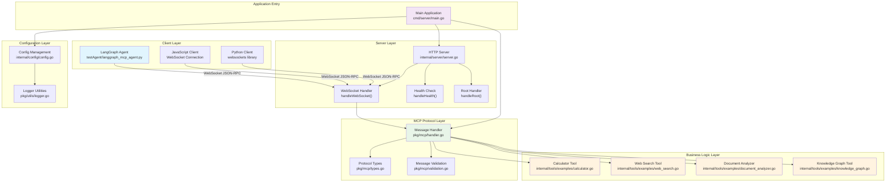
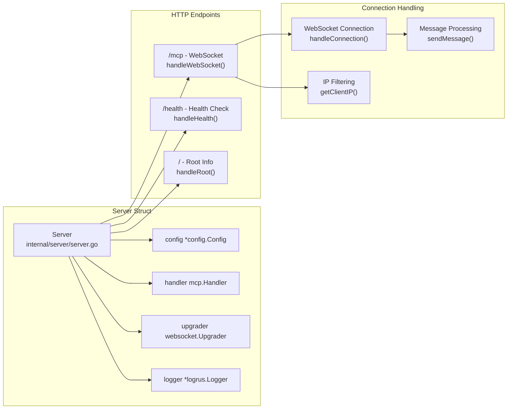
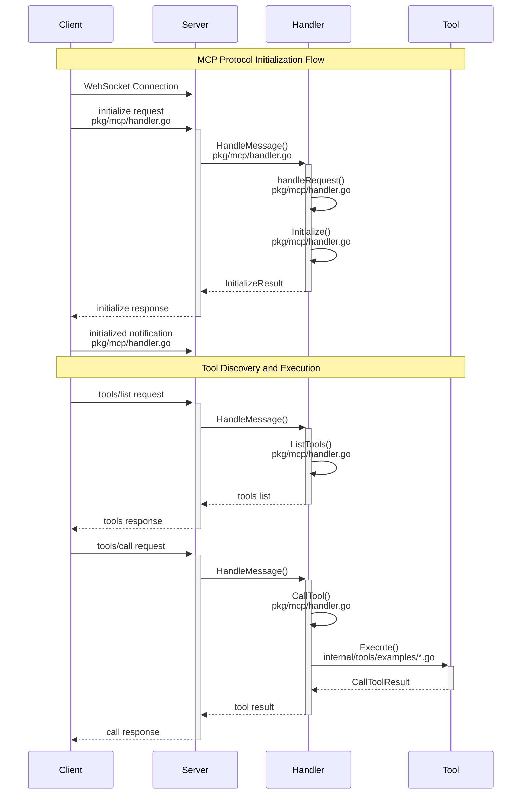
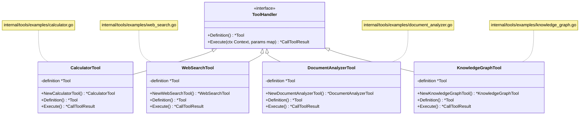
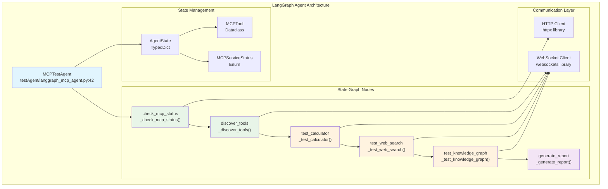
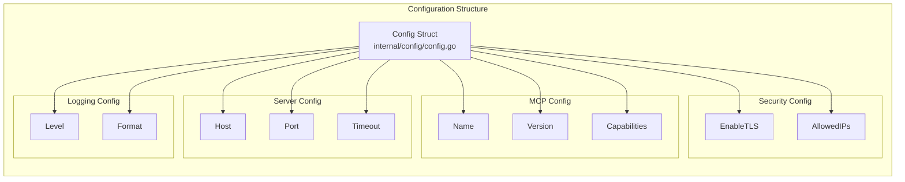
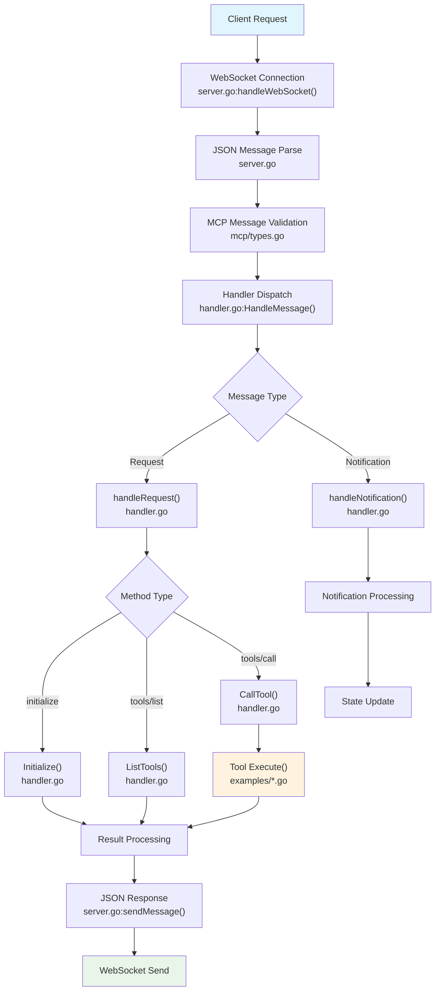
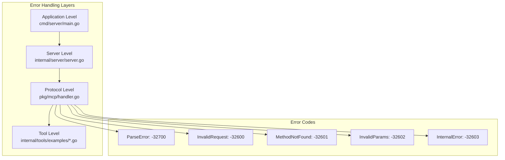

# MCP Go Template 架构设计文档

本文档详细描述了 MCP Go Template 项目的架构设计，所有架构组件都与实际代码文件和函数一一对应。

## 系统整体架构



## 1. 应用程序入口点

### 主程序 (`cmd/server/main.go`)

**核心函数：**
- `main()` - 程序入口点，负责整体初始化和生命周期管理
- `createServerCapabilities()` - 根据配置创建服务器能力
- `registerTools()` - 注册所有工具实例

**主要职责：**
1. 解析命令行参数
2. 加载配置文件 (`config.Load()`)
3. 设置日志系统 (`utils.SetLogLevel()`)
4. 创建MCP处理器 (`mcp.NewBaseHandler()`)
5. 注册工具集合 (`registerTools()`)
6. 启动服务器 (`srv.Start()`)
7. 优雅关闭处理

## 2. 服务器层架构

### HTTP 服务器 (`internal/server/server.go`)



**关键函数说明：**

- `New()` - 创建服务器实例，初始化WebSocket升级器
- `Start()` - 启动HTTP服务器，支持TLS和优雅关闭
- `handleWebSocket()` - 处理WebSocket连接升级和IP过滤
- `handleConnection()` - 处理单个WebSocket连接的消息循环
- `sendMessage()` - 发送JSON-RPC消息到客户端
- `handleHealth()` - 健康检查端点，返回服务状态
- `getClientIP()` - 提取客户端真实IP地址

## 3. MCP协议层架构

### 消息处理流程



### MCP处理器 (`pkg/mcp/handler.go`)

**BaseHandler结构：**
```go
type BaseHandler struct {
    serverInfo   ServerInfo
    capabilities ServerCapabilities
    tools        map[string]ToolHandler
    resources    map[string]ResourceHandler
    prompts      map[string]PromptHandler
    initialized  bool
}
```

**关键函数：**
- `NewBaseHandler()` - 创建基础处理器实例
- `HandleMessage()` - 处理所有MCP消息的入口点
- `handleRequest()` - 处理请求消息的分发器
- `handleNotification()` - 处理通知消息
- `Initialize()` - 处理初始化请求
- `CallTool()` - 执行工具调用
- `RegisterTool()` - 注册工具实例

## 4. 工具系统架构

### 工具接口设计



### 具体工具实现

#### 1. 计算器工具 (`internal/tools/examples/calculator.go`)

**结构定义：**
```go
type CalculatorTool struct {
    definition *mcp.Tool
}
```

**关键函数：**
- `NewCalculatorTool()` - 构造函数，定义工具规范
- `Definition()` - 返回工具定义
- `Execute()` - 执行数学运算

**支持操作：** add, subtract, multiply, divide, power

#### 2. 网络搜索工具 (`internal/tools/examples/web_search.go`)

**主要功能：**
- 多搜索引擎支持 (DuckDuckGo, Bing, Google)
- 搜索结果解析和结构化输出
- 安全搜索配置

#### 3. 文档分析工具 (`internal/tools/examples/document_analyzer.go`)

**主要功能：**
- 支持文件、URL、文本分析
- 关键词提取和频率分析
- 文档统计和摘要生成

#### 4. 知识图谱工具 (`internal/tools/examples/knowledge_graph.go`)

**主要功能：**
- 实体提取和关系构建
- 图谱可视化支持
- 智能查询处理

## 5. 测试架构 - LangGraph 集成

### 测试智能体架构



**关键组件说明：**

#### MCPTestAgent类 (`testAgent/langgraph_mcp_agent.py`)

**核心属性：**
- `mcp_server_url` - MCP服务器地址
- `websocket` - WebSocket连接实例
- `http_client` - HTTP客户端实例
- `graph` - LangGraph状态图

**关键方法：**
- `_send_mcp_request()` - 发送JSON-RPC请求
- `_build_graph()` - 构建状态图工作流
- `run_tests()` - 执行完整测试流程

#### 测试运行器 (`testAgent/test_runner.py`)

**主要函数：**
- `quick_test()` - 快速连接和工具发现测试
- `main()` - 完整功能测试流程

## 6. 配置管理架构

### 配置系统 (`internal/config/config.go`)



**关键函数：**
- `Load()` - 加载YAML配置文件
- `GetAddress()` - 获取服务器监听地址
- `IsToolsEnabled()` - 检查工具功能是否启用
- `IsLoggingEnabled()` - 检查日志功能是否启用

## 7. 数据流向分析

### 完整请求处理流程



## 8. 错误处理架构

### 错误处理层次




## 总结

此架构设计确保了：

1. **模块化**: 每个组件职责明确，代码位置清晰
2. **可扩展性**: 工具系统支持轻松添加新功能
3. **可测试性**: LangGraph智能体提供完整的自动化测试
4. **可维护性**: 配置管理和错误处理层次分明
5. **标准兼容**: 完整实现MCP协议规范

所有架构组件都与实际代码文件一一对应，便于开发者理解和维护。